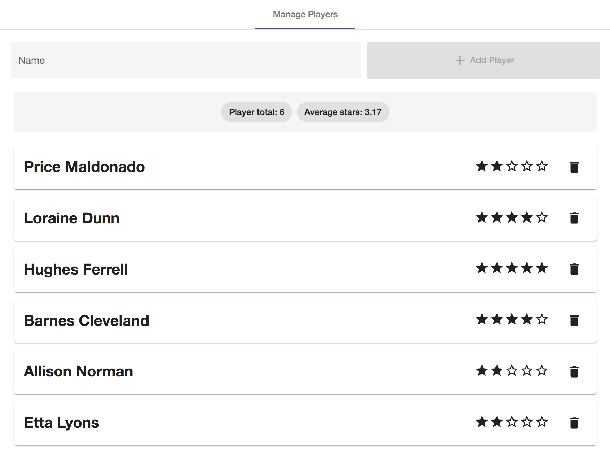

# Player-Manager



## Setup npm

Um die Anwendung Player-Manager starten zu können, müssen Node und npm lokal installiert sein.
Ist das nicht der Fall, sollte man sich folgendes Tutorial anschauen: https://docs.npmjs.com/downloading-and-installing-node-js-and-npm. 

## Setup Projekt

Setup des Projekts in 2 Schritten:

1 - Installieren der Dependencies
```
npm i
```

2 - Starten der Anwendung
```
npm run start:player-manager
```
 
