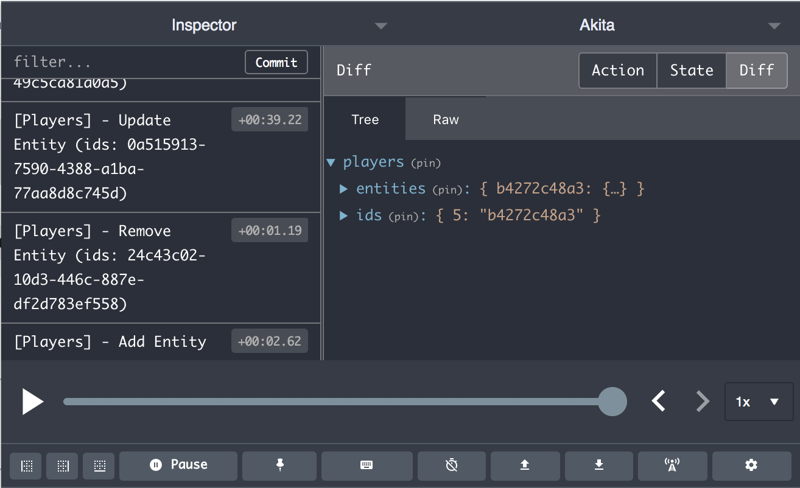

# State Management in Webapplikationen mit Akita

## Motivation

Webapplikationen haben häufig die Aufgabe, Informationen unterschiedlicher Quellen darzustellen. Zum Funktionsumfang solcher Anwendungen gehört 
neben der Darstellung auch oft die Aktualisierung, Erweiterung und Löschung bestimmter Daten. Um solche Funktionen zu ermöglichen, müssen diese Daten im 
Client vorgehalten werden. Die Gesamtheit der vom Client vorgehaltenen Informationen kann als State beziehungsweise Zustand der Applikation bezeichnet werden.

Eine Herausforderung bei der Darstellung von Informationen in Webapplikationen ist, dass die Requests häufig an verschiedene Quellen geschickt werden und die 
Responses zu beliebigen Zeitpunkten zurückkommen. Es ist wichtig die einzelnen Komponenten des Clients zur richtigen Zeit mit neuen Daten zu aktualisieren
und neu zu rendern, allerdings erfordert das auch einen gut strukturierten Datenfluss. Darüber hinaus hat man häufig die Aufgabe, ein und die selbe Information an
an verschiedenen Stellen einer Anwendung darzustellen. Auch hierbei muss man sich gut überlegen, wie man die Daten über die Applikation hinweg verteilt, ohne dabei
den Überblick zu verlieren oder die gleichen Daten mehrfach abzulegen.

Wenn man sich solchen Problemstellungen gegenübersteht und den State seiner Anwendung ordentlich verwalten möchte, kommt man um State Management Frameworks
kaum herum. In diesem Beitrag wird die Funktionsweise eines solchen Frameworks am Beispiel von Akita erklärt. Akita ist im Angular Umfeld entstanden und basiert
auf Ideen anderer Frameworks wie NGRX. Die Code-Beispiele kommen aus einer Angular-Anwendung, allerdings ist Akita selbst nicht abhängig von der verwendeten 
Frontend-Technologie und kann genauso gut mit Frameworks wie React oder Vue.js verwendet werden. Im Vergleich mit anderen State Management Frameworks benötigt eine 
Implementierung mit Akita deutlich weniger Boilerplate Code und bietet somit auch einen einfach Einstieg. 

## Funktionsweise


Im Mittelpunkt des State Management Frameworks von Akita stehen die sogenannten Stores. Ein Store verwaltet für den Client relevanten Daten und kann
als eine Art "Frontend-Repository" angesehen werden. Im Normalfall ist ein Store für die Verwaltung einer einzelnen Entität zuständig, sodass eine Anwendung meist 
aus mehreren Stores besteht. Um den Zugriff auf die Entitäten zu ermöglichen, werden für jeden Store Queries definiert. Diese Queries können in die einzelnen 
Komponenten eingebunden werden, wo die Daten letztendlich dem User sichtbar gemacht werden. Der Datenfluss über die Queries zu den Komponenten wird über asynchrone 
Streams realisiert, die man aus dem RXJS Framework kennt. Das führt dazu, dass Aktualisierungen des Stores direkt an die Komponenten weitergegeben werden und
die neuen Informationen unverzüglich neu gerendert werden.

Damit Informationen aus dem Store gelesen werden können, muss der Store zuerst mit Daten befüllt werden, wofür ein Service zuständig ist. Lediglich dieser Service
darf den Zustand des Stores verändern. Außerdem ist der Service dafür zuständig, über asynchrone Aufrufe Daten von externen Systemen zu beziehen und die Informationen
an den Store weiterzugeben. Den Komponenten stellt der Service Methoden bereit, mit denen der User Änderungen am Store auslösen kann. 

Die oben beschriebenen Komponenten und Abläufe stellen die Basis des Akita-Patterns da, an die man sich bei einer Implementierung halten sollte. Wichtig ist vor 
allem die Einhaltung des unidirektionalen Datenflusses, der eine gute Nach­voll­zieh­bar­keit der Vorgänge innerhalb der Anwendung ermöglicht. Das Entwickler Team von
Akita definiert 4 High-Level Prinzipien, die man als Entwickler zusätzlich beachten sollte. Teilweise ergeben sich die Prinzipien bereits aus dem Akita-Pattern selbst. 

## High-Level Prinzipien

1. Ein Store ist ein einzelnes Objekt, welches den aktuellen Zustand des Stores beinhaltet und als "Single source of truth" dient
2. Der Zustand des Stores kann nur mit einer einzigen Methode (`setState()`) verändert werden
3. Komponenten greifen nicht direkt, sondern über vordefinierte Queries auf den Store zu 
4. Die Aktualisierung des Stores und weitere asynchrone Logik soll in einem Service gekapselt werden   

## Bestandteile von Akita


Um die Funktionsweise von Akita zu veranschaulichen, habe ich die Beispielanwendung "Player-Manager" geschrieben. Der "Player-Manager" ist eine simple CRUD-Anwendung 
(Create Read Update Delete), mit der eine Liste von Spielern verwaltet werden können. In der Anwendung kann man Spieler hinzufügen, löschen und das Rating eines Spielers anpassen. 
Wenn ihr den kompletten Code nachvollziehen wollt, findet ihr das Projekt auf [Github](https://github.com/german-reindeer/team-chooser-akita/tree/master/). Ansonsten kann man in dem
Screenshot weiter oben erkennen, wie die Anwendung aufgebaut ist.  

### Model

```typescript
export interface Player {
  id: ID;
  name: string;
  rating: number;
}
```

Das zentrale Model der Anwendung ist einfach gehalten. Die Attribute "name" und "rating" beschreiben den verwalteten Spieler, das Attribut "id" dient der 
Identifizierung. Um die Vorzüge von Akita voll nutzen zu können, ist es wichtig, dass das Model eine eindeutige ID besitzt. Der Interface ID wird von Akita selbst
bereitgestellt.

### Store

```typescript
@StoreConfig({
  name: 'players'
})
export class PlayersStore extends EntityStore<PlayersState, Player> {
  constructor() {
    super(initialState);
  }
}
```
Um Informationen zu verschiedenen Spielern zu verwalten, implementieren wir einen Store. Hierzu erweitern wird die von Akita bereitgestellte EntityStore-Klasse. 
Vereinfacht kann man sich einen solchen EntityStore als Datenbanktabelle vorstellen. Im Vergleich zur der normalen Store-Klasse von Akita bietet der EntityStore
bereits eigene CRUD-Methoden an, die das Verwalten von Entitäten vereinfachen und viel Boilerplate Code sparen. Wenn wir vom EntityStore erben, müssen wir sowohl
das Model des verwalteten States (PlayersState), als auch das Model der zu verwaltenden Entität (Player) definieren. Das angegebene State muss wiederum das von Akita
definierte EntityState-Interface erweitern.
```typescript
export interface PlayersState extends EntityState<Player> {}
```
Um den PlayerStore nutzen zu können, müssen wir lediglich den Constructor, in dem wir lediglich den Constructor von EntityStore mit dem initialen Zustand des Stores
aufrufen. Gehen wir davon aus, dass der PlayerStore zum Start der Applikation keine Objekte beinhaltet, können wir die initialState Variable als leeres Objekt 
initialiseren.
```typescript
const initialState: PlayersState = {};
```
Über den `@StoreConfig` Decorator können wir zusätzlich Eigenschaften des Stores wie den Namen konfigurieren. Das wird wichtig, wenn unsere Anwendung komplexer wird 
und weitere Stores beinhaltet. Mehr Implementierung ist für den PlayerStore nicht nötig und wir können ihn im nächsten Schritt in einen Service einbinden. Durch die 
Erweiterung des EntityStore stellt der PlayersStore nun unter anderem Methoden wie `add`, `update`, `upsert` und `remove` zur Verfügung. Die komplette List kann man
in der [Dokumentation](https://netbasal.gitbook.io/akita/entity-store/entity-store/api) finden.

### Service

```typescript
export class PlayersService {

  constructor(private store: PlayersStore,
              private http: PlayersHttpService) {
  }

  retrieveAll(): void {
    this.http
      .retrieveAll()
      .pipe(take(1))
      .subscribe(players => this.store.add(players));
  }

  add(players: Player[]): void {
    this.http
      .add(players)
      .pipe(take(1))
      .subscribe(addedPlayers => this.store.add(addedPlayers));
  }

  remove(id: string): void {
    this.http
      .remove(id)
      .pipe(take(1))
      .subscribe(() => this.store.remove(id));
  }

  updateRating(id: string, rating: number): void {
    this.http
      .update(id, rating)
      .pipe(take(1))
      .subscribe(updatedRating => this.store.update(id, {rating: updatedRating}));
  }

}
```

Der Service stellt für unsere Anwendung eine Schnittstelle zum Store dar, über UI-Komponenten Veränderungen am State auslösen können. Die UI-Komponenten könnten den Store direkt aufrufen, 
allerdings würde das den High-Level Prinzipien von Akita widersprechen. Darüber hinaus ist es durchaus praktisch, die Verarbeitung asynchroner Aufrufe in einem Service zu kapseln.
In dem PlayersService greifen wir auf den PlayersHttpService zu, welcher die Kommunikation mit einer API übernimmt. Zu Anschauungszwecken ist der PlayersHttpService ein
Dummy, der Dummy-Daten zurückgibt. Die Methoden des PlayersHttpService geben Observables zurück, über die wir an die Daten der API-Aufrufe gelangen. Wem Observables gänzlich 
unbekannt sind, sollte sich ein Tutorial zu dem RxJs Framework anschauen (z.B. [hier](https://angular.io/guide/rx-library)). Kurz zusammengefasst: Observables geben 
über einen Stream asynchron Daten zurück.

Schauen wir uns beispielhaft die Methode `retrieveAll()` an: Innerhalb der Methode rufen wir die Methode `retrieveAll()` des PlayersHttpService auf, welche ein Observable des 
Typs `Player[]` zurückgibt. Mit `subscribe()` melden wir uns bei dem Observable an, und definieren innerhalb des Methodenaufrufs, dass wir die Methode `store.add()` mit
den `players`-Objekt aufrufen, das wir vom Observable erhalten. Einfach ausgedrückt: Wir machen einen REST-Call, der uns alle Spieler einer API zurückgeben soll. Wenn 
wir die Antwort des Calls erhalten, speichern wir die Spieler aus der Antwort in unserem Store. 

Die anderen Methoden bieten die weitere Funktionalität an, die es für einen CRUD-Service braucht. Die Methoden des Stores, die hier aufgerufen werden, mussten wir 
allesamt nicht selbst entwickeln, da diese vom EntityStore bereitgestellt werden. Hier spart sich Akita im Vergleich zu anderen State Management Frameworks einiges an
Boilerplate Code, was das Entwickeln sehr angenehm macht.  

Der Aufruf `pipe(take(1))` in den einzelnen Methoden kommt aus dem RxJs Framework und sagt aus, dass wir nur so lange an dem Observable angemeldet sind, bis wir das erste
Mal ein Objekt erhalten haben.       


### Query

```typescript
export class PlayersQuery extends QueryEntity<PlayersState> {

  constructor(protected store: PlayersStore) {
    super(store);
  }
  
}
```

Als letzen Bestandteil der Akita Implementierung brauchen wir noch einen Service, der die Daten des Stores bereitstellt. Auch hier haben wir kaum etwas zu implementieren,
da die Klasse QueryEntity, von der wir erben, bereits viele nützliche Methoden mitbringt. Eine bereits implementierte Methode ist `getAll`, welche in diesem Fall alle sich
im Store hinterlegten Spieler als Array zurückgibt. Zusätzlich dieser Methode gibt es ein `selectAll`, welches ein Observable des Spieler Arrays zurückgibt. Mit Observables
zu arbeiten hat den Vorteil, dass man mitbekommt, wenn sich Daten der angefragten Quelle verändern. Benutzen wir also die `select` Methoden der PlayersQuery-Klasse, welche
Observables zurückgeben, können wir stets die aktuellen Daten des Stores anzeigen, ohne erneut eine Methode der PlayersQuery-Klasse aufrufen zu müssen.  

### Einbindung in Komponenten

```typescript
@Component({
  selector: 'manage-players',
  templateUrl: './manage-players.component.html',
  styleUrls: ['./manage-players.component.scss']
})
export class ManagePlayersComponent {

  playerForm: FormGroup;

  allPlayers$: Observable<Player[]>;

  constructor(private playersQuery: PlayersQuery,
              private playersService: PlayersService,
              private formBuilder: FormBuilder) {
    this.initFormGroup();
    this.allPlayers$ = this.playersQuery.selectAll();
  }

  addPlayer(): void {
    const name = this.playerForm.value.name;
    if (name) {
      this.playersService.add([createPlayer(name, 0)]);
      this.playerForm.reset();
    }
  }

  updatePlayerRating(playerId: string, rating: number): void {
    this.playersService.updateRating(playerId, rating);
  }

  removePlayer(playerId: string): void {
    this.playersService.remove(playerId);
  }

  ...

}
```

Nachdem nun alle Akita-spezischen Bestandteile implementiert sind, können wir das State Management in den UI-Komponenten einbinden. Hierfür injezieren wir zuerst die Services PlayersQuery und PlayersService über den 
Constructor. Nun können wir die Methode `selectAll` der PlayersQuery-Klasse aufrufen und erhalten ein Observable aller Player-Objekte, die sich zu diesem Zeitpunkt im Store befinden. Das Observable wird in der 
Variable `allPlayers$` gespeichert, auf die das HTML-Template der Komponente zugreift. Hat die Komponente das Player-Observable erhalten, können die Player-Informationen in einer Liste dargestellt werden. 
Zusätzlich zum Constructor bietet die Komponente die Methoden `addPlayer`, `updatePlayerRating` und `removePlayer`, welche vom Anwender per Klick getriggert werden können. Wird bespielsweise die Methode `removePlayer`
aufgerufen, ruft die Komponente die `remove` Methode des PlayersService auf und das referenzierte Players-Objekt wird aus dem PlayersStore entfernt. Das führt widerum dazu, dass sich das `allPlayers$` Observable
aktualisiert und eine neue Liste an Player-Objekten erhält, in der der zuvor gelöschte Player nicht mehr enthalten ist. Anschließend wird das Template der Komponente mit der neuen Player-Liste aktualisiert.
Mit den Methoden `addPlayer` und `updatePlayerRating` können neue Player hinzugefügt oder bestehende Player-Informationen werden, was die CRUD-Anwendung dann komplettiert. Wenn ihr den ganzen Code Quellcode inklusive aller Templates
nachvollziehen wollt, verweise ich erneut auf [Github-Projekt](https://github.com/german-reindeer/team-chooser-akita/tree/master/).


## Devtools



Wer viel im Frontend entwickelt weiß, dass das Debugging manchmal schwer fallen kann. In Bezug auf Akita gibt es allerdings das Plugin Redux DevTools, dass die Fehlersuche extrem vereinfacht. Redux DevTools zeigt
euch zu jeder Zeit den aktuellen Inhalt des Stores an und speichert zudem eine komplette Historie aller Änderungen der Daten im Store. Somit könnt ihr exakt nachvollziehen in welcher Reihenfolge sich die Daten
in eurem Store aus welche Weise verändert haben, was das entwickeln mit Akita sehr transparent macht. Das Plugin gibt es sowohl für [Chrome](https://chrome.google.com/webstore/detail/redux-devtools/lmhkpmbekcpmknklioeibfkpmmfibljd?hl=de) 
als auch für [Firefox](https://addons.mozilla.org/de/firefox/addon/reduxdevtools/).       

## Ausblick 

Das Akita Framework bietet noch viele weitere Aspekte, die ich in diesem Artikel nicht angesprochen habe. In einer realen Anwendung wird man mit hoher Wahrscheinlichkeit mehrere Stores implementieren, 
welche dann widerum Beziehungen zueienander haben. Dann sollte man über Themen wie die Normalisierung von Daten nachdenken, was mit Akita ebenfalls realisierbar ist. Mit zunehmender Größe einer Applikation steigt zudem
auch häufig die Komplexität der Abfragen in den Query-Klassen, über die man ein eigenes Tutorial schreiben könnte. Wer sich über solche und weitere Themen im Bezug auf Akita informieren möchte, dem lege ich die offizielle
Dokumentation von Akita ans Herz, die sowohl von der Struktur als auch vom Umfang sehr gelungen ist. Andere Einstiegspunkte und Tutorials sind zudem in den Quellen aufgeführt.       

## Quellen

* https://netbasal.gitbook.io/akita/
* https://blog.ng-book.com/managing-state-in-angular-using-akita/
* https://netbasal.com/introducing-akita-a-new-state-management-pattern-for-angular-applications-f2f0fab5a8
* https://netbasal.com/working-with-normalized-data-in-akita-e626d4c67ca4
* https://engineering.datorama.com/our-journey-in-angular-from-ngrx-to-akita-9b70b3d7ea70


